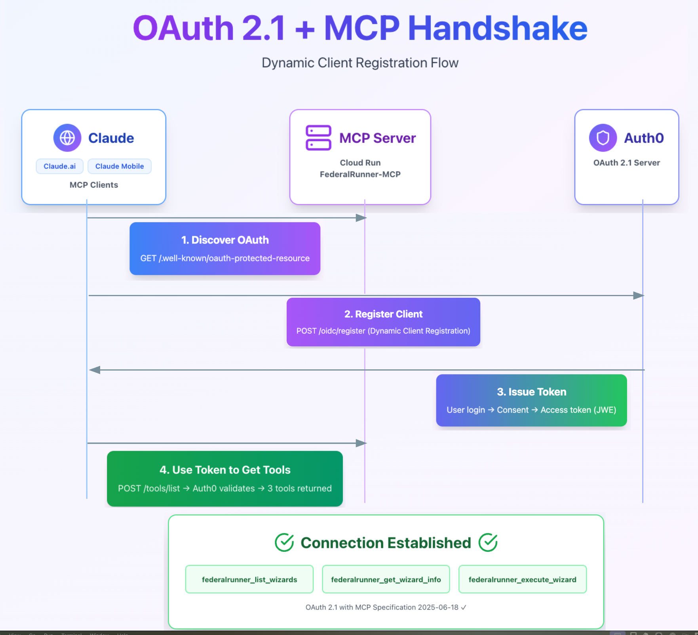

## Table of Contents

1. [Overview & Architecture](#overview--architecture)
2. [Prerequisites & Setup](#prerequisites--setup)
3. [Phase 1: Auth0 Configuration](#phase-1-auth0-configuration)
4. [Phase 2: Code Implementation](#phase-2-code-implementation)
5. [Phase 3: Critical Authentication Architecture](#phase-3-critical-authentication-architecture)
6. [Phase 4: Deployment & Testing](#phase-4-deployment--testing)
7. [Phase 5: Troubleshooting Guide](#phase-5-troubleshooting-guide)
8. [Appendix: Key Learnings](#appendix-key-learnings)

---

## Overview & Architecture

### What We're Building

A remote MCP (Model Context Protocol) server that:
- Runs on Google Cloud Run (serverless)
- Authenticates via OAuth 2.1 with Auth0
- Supports Dynamic Client Registration (DCR)
- Works with Claude.ai web and Claude Android mobile app
- Provides 3 FederalRunner federal form automation tools

### Why This Is Complex

MCP protocol has a specific handshake sequence that conflicts with standard OAuth patterns:
1. **initialize** - Must work WITHOUT authentication (protocol requirement)
2. **notifications/initialized** - Session validation only, no OAuth yet
3. **tools/list** - Full OAuth + session validation required
4. **tools/call** - Full OAuth + session validation required

**The Challenge**: FastAPI's dependency injection runs authentication BEFORE seeing the request, but we need conditional authentication based on the MCP method type.

### OAuth 2.1 + MCP Integration Flow

Here's the simplified 4-step flow:



**Quick Summary:**
1. **Discover OAuth** - Claude fetches `/.well-known/oauth-protected-resource` to discover Auth0
2. **Register Client** - Dynamic Client Registration (DCR) with Auth0
3. **Issue Token** - User authenticates and grants permissions (scopes: `federalrunner:read`, `federalrunner:execute`)
4. **Use Tools** - MCP server validates token, returns 3 FederalRunner tools

**Detailed sequence diagram**: See [MCP_HANDSHAKE_DIAGRAM.md](../mcp-integration/MCP_HANDSHAKE_DIAGRAM.md) for the complete 24-step handshake flow.

### Detailed Architecture Diagram

```
┌─────────────────┐
│  Claude.ai Web  │
│       or        │──┐
│ Claude Android  │  │
└─────────────────┘  │
                     │ 1. HEAD / (discover protocol)
                     │ 2. GET /.well-known/oauth-protected-resource (discover Auth0)
                     │ 3. POST /oidc/register (DCR - create client)
                     │ 4. User OAuth flow (login + consent)
                     │ 5. POST / initialize (no auth)
                     │ 6. POST / notifications/initialized (session only)
                     │ 7. POST / tools/list (OAuth + session)
                     │ 8. POST / tools/call (OAuth + session)
                     ▼
         ┌─────────────────────┐
         │  Google Cloud Run   │
         │   (Public Access)   │
         │                     │
         │  ┌───────────────┐  │
         │  │ FastAPI Server│  │
         │  │ (Port 8080)   │  │
         │  │               │  │
         │  │ • Selective   │  │
         │  │   OAuth       │  │
         │  │ • Session     │  │
         │  │   Management  │  │
         │  │ • Playwright  │  │
         │  │   Client      │  │
         │  └───────────────┘  │
         └─────────────────────┘
                     │
                     │ Token validation
                     ▼
         ┌─────────────────────┐
         │      Auth0          │
         │  (Authorization     │
         │   Server)           │
         │                     │
         │ • DCR enabled       │
         │ • API defined       │
         │ • Scopes configured │
         │ • JWKS public keys  │
         └─────────────────────┘
```

---

## Prerequisites & Setup

### Required Accounts
- Google Cloud account with billing enabled
- Auth0 free account
- Claude Pro/Max subscription (free tier doesn't support custom connectors)

### Required Tools
```bash
# Verify installations
python3.11 --version  # Should be 3.11+
gcloud --version      # Google Cloud SDK
git --version
```

### Initial Google Cloud Setup
```bash
# Set project
gcloud config set project YOUR-PROJECT-ID

# Set region
gcloud config set run/region us-central1

# Enable required APIs
gcloud services enable run.googleapis.com
gcloud services enable cloudbuild.googleapis.com
gcloud services enable secretmanager.googleapis.com
```

---

## Phase 1: Auth0 Configuration

### Step 1.1: Create Auth0 Account

1. Go to https://auth0.com → Sign Up
2. Choose **Personal** account type
3. **Critical**: Choose tenant name carefully (can't change easily)
   - Example: `federalrunner-mcp`
   - This becomes: `federalrunner-mcp.us.auth0.com`
4. Select region: **US** (closest to Cloud Run)
5. Complete setup wizard

### Step 1.2: Enable Dynamic Client Registration (DCR)

**Why**: Claude Android needs to register itself as an OAuth client at runtime.

**Steps**:
1. Auth0 Dashboard → **Applications** → **APIs**
2. Click **Auth0 Management API** (pre-created)
3. **Machine to Machine Applications** tab
4. Find your default application
5. Toggle to **Authorized**
6. Click arrow to expand permissions
7. Enable these 4 permissions:
   - ☑ `create:clients`
   - ☑ `read:clients`
   - ☑ `update:clients`
   - ☑ `delete:clients`
8. Click **Update**

**Verify DCR Works**:
```bash
curl -X POST https://YOUR-TENANT.us.auth0.com/oidc/register \
  -H "Content-Type: application/json" \
  -d '{
    "client_name": "Test DCR",
    "redirect_uris": ["https://localhost/callback"],
    "grant_types": ["authorization_code"],
    "response_types": ["code"],
    "token_endpoint_auth_method": "none"
  }'
```

**Expected**: JSON response with `client_id` field

**If it fails**: DCR not properly enabled. Re-check the 4 permissions above.

### Step 1.3: Create Auth0 API

1. **Applications** → **APIs** → **Create API**
2. Fill in:
   - **Name**: `FederalRunner MCP Server`
   - **Identifier**: `https://federalrunner-mcp-server` (temporary, will update after deployment)
   - **Signing Algorithm**: RS256
3. Click **Create**

4. Go to **Permissions** tab
5. Add these scopes:

| Scope | Description |
|-------|-------------|
| `federalrunner:read` | List wizards and get wizard information |
| `federalrunner:execute` | Execute federal form wizards with user data |

6. Click **Save** after each scope

### Step 1.4: Create Application User

**Critical**: This is separate from your Auth0 dashboard account!

1. **User Management** → **Users** → **Create User**
2. Enter:
   - **Email**: `your-email@gmail.com` (can be same as dashboard email)
   - **Password**: Choose a strong password
   - **Connection**: Username-Password-Authentication
3. Click **Create**

**Important**: You'll use these credentials during OAuth flow, not your dashboard credentials.

### Step 1.5: Save Configuration

Create `~/auth0-credentials-federalrunner.txt`:
```bash
# Auth0 Configuration
AUTH0_DOMAIN=YOUR-TENANT.us.auth0.com
AUTH0_TENANT=YOUR-TENANT
AUTH0_ISSUER=https://YOUR-TENANT.us.auth0.com/
AUTH0_API_AUDIENCE=https://federalrunner-mcp-server

# These will be updated after deployment
MCP_SERVER_URL=http://localhost:8080
SERVICE_URL=https://federalrunner-mcp-[YOUR-HASH].run.app
```

**Note**: Keep the trailing slash in `AUTH0_ISSUER` - it's required!

---

## Phase 2: Code Implementation

### Step 2.1: Project Structure

```
mcp-servers/federalrunner-mcp/
├── src/
│   ├── __init__.py
│   ├── server.py          # ← FastAPI server with OAuth
│   ├── auth.py            # ← OAuth validation 
│   ├── config.py          # ← Settings management
│   ├── logging_config.py  # ← Structured logging
│   ├── playwright_client.py  # ← Browser automation (atomic execution)
│   ├── execution_tools.py    # ← FederalRunner MCP tools
│   ├── schema_validator.py   # ← User data validation
│   └── models.py             # ← Wizard structure models
├── Dockerfile             # ← Container definition
├── .dockerignore          # ← Exclude from build
├── requirements.txt       # ← Python dependencies
└── .env                   # ← Local development config
```

### Step 2.2: Configuration (`src/config.py`)

**Purpose**: Manages environment variables for Auth0 and server configuration.

**Key Configuration Values**:
- `AUTH0_DOMAIN` - Your Auth0 tenant (e.g., "your-tenant.us.auth0.com")
- `AUTH0_API_AUDIENCE` - Your deployed service URL
- `AUTH0_ISSUER` - Auth0 issuer URL **with trailing slash** (critical!)
- `MCP_SERVER_URL` - Server URL for OAuth metadata
- `PORT` - Server port (default: 8080)

**Implementation**: See `mcp-servers/federalrunner-mcp/src/config.py`

The configuration uses Pydantic Settings for type validation and automatic loading from environment variables or `.env` files.

### Step 2.3: Logging Configuration (`src/logging_config.py`)

**Purpose**: Provides structured logging for Cloud Run and local development.

**Features**:
- Console output to stdout (captured by Cloud Run)
- File logging for local development (logs/ directory)
- Module-specific loggers with consistent formatting
- Configurable log levels (INFO for production, DEBUG for development)

**Implementation**: See `mcp-servers/federalrunner-mcp/src/logging_config.py`

The logging system provides comprehensive visibility into OAuth token validation, MCP requests, tool execution, and error conditions.

### Step 2.4: Authentication (`src/auth.py`)

**Critical**: This is where most bugs happened during development. The key innovation is **manual token validation** to support selective authentication.

**Implementation**: See `mcp-servers/federalrunner-mcp/src/auth.py` 

**Key Functions**:

1. **`get_jwks()`** - Fetches JSON Web Key Set from Auth0 (cached with `@lru_cache`)
2. **`validate_via_userinfo(token)`** - Validates JWE/opaque tokens using Auth0's userinfo endpoint
3. **`verify_token_manual(request)`** - **Core function** for manual token validation
4. **`get_token_scopes(payload)`** - Extracts scopes from decoded token
5. **`require_scope(scope, scopes)`** - Validates required scope for operations

**Dual Token Support**:

Auth0 can issue two token types:
- **JWT tokens** (have `kid` in header) → Validated via JWKS signature verification
- **JWE/opaque tokens** (no `kid`) → Validated via Auth0 userinfo endpoint

The implementation automatically detects token type and uses the appropriate validation path.

**Why Manual Validation?**

MCP protocol requires **different authentication** for different methods:
- `initialize` - NO auth (must work without token)
- `notifications/initialized` - Session validation only
- `tools/list`, `tools/call` - Full OAuth validation

FastAPI's `Depends()` dependency injection runs **before** the handler can read the request body to see which method is being called. Manual validation allows conditional authentication based on MCP method type.

**Critical Pattern**:
```python
# ❌ DON'T use Depends() - forces auth for all requests
@app.post("/")
async def endpoint(token: Dict = Depends(verify_token)):
    pass

# ✅ DO use manual validation - conditional based on method
@app.post("/")
async def endpoint(request: Request):
    body = await request.json()
    if body['method'] in ['tools/list', 'tools/call']:
        token = await verify_token_manual(request)
```

### Step 2.5: Server Implementation (`src/server.py`)

**Implementation**: See `mcp-servers/federalrunner-mcp/src/server.py`

**Architecture**: FastAPI server implementing MCP protocol 2025-06-18 with selective OAuth authentication.

**Key Components**:

**1. Server Setup & Lifecycle**:
- FastAPI app with async lifespan management
- PlaywrightClient uses atomic execution (browser launched per request)
- CORS middleware for Claude.ai access
- Request/response logging middleware

**2. Public Endpoints** (no auth required):
- `HEAD /` - MCP protocol discovery
- `GET /health` - Health check
- `GET /.well-known/oauth-protected-resource` - OAuth metadata (RFC 9728)

**3. Core MCP Endpoint** (`mcp_endpoint` function):

**Selective Authentication Pattern**:
```python
async def mcp_endpoint(request: Request):
    body = await request.json()
    method = body.get('method')

    if method == 'initialize':
        # ❌ NO authentication - creates session
        session_id = str(uuid.uuid4())
        return initialize_response(session_id)

    elif method == 'notifications/initialized':
        # ✅ Session validation ONLY (no OAuth)
        validate_session(session_id, request)
        return Response(status_code=202)

    elif method in ['tools/list', 'tools/call']:
        # ✅ FULL authentication (OAuth + session)
        token = await verify_token_manual(request)
        validate_session(session_id, request)
        return handle_tool_operation(token)
```

**4. Tool Definitions** (`get_tools` function):
- `federalrunner_list_wizards` - List all discovered wizards
- `federalrunner_get_wizard_info` - Get wizard schema (THE CONTRACT)
- `federalrunner_execute_wizard` - Execute wizard with user data

**5. Tool Execution** (`execute_tool` function):
- Scope-based authorization (`federalrunner:read` or `federalrunner:execute`)
- Integration with PlaywrightClient for atomic execution
- MCP content format responses (text + images)

**Critical Status Codes**:
- `200 OK` - Successful JSON-RPC responses
- `202 Accepted` - Notification received
- `204 No Content` - Session deletion
- `405 Method Not Allowed` - GET on POST-only endpoint (NOT 501!)
- `401 Unauthorized` - Missing/invalid token
- `403 Forbidden` - Insufficient permissions

**MCP Headers** (required for all responses):
- `MCP-Protocol-Version: 2025-06-18`
- `MCP-Session-ID: <uuid>` (after initialize)

### Step 2.6: Dockerfile

```dockerfile
# Use Python 3.11 slim
FROM python:3.11-slim

# Set working directory
WORKDIR /app

# Install system dependencies
RUN apt-get update && apt-get install -y \
    wget \
    gnupg \
    && rm -rf /var/lib/apt/lists/*

# Copy requirements first (for caching)
COPY requirements.txt .

# Install Python dependencies
RUN pip install --no-cache-dir -r requirements.txt

# Install Playwright and WebKit (FSA compatibility - headless mode works)
RUN playwright install --with-deps webkit

# Copy application code
COPY src/ ./src/

# Expose port
EXPOSE 8080

# Run server
CMD ["uvicorn", "src.server:app", "--host", "0.0.0.0", "--port", "8080"]
```

### Step 2.7: .dockerignore

```
__pycache__/
*.pyc
*.pyo
*.pyd
.Python
*.so
*.egg
*.egg-info/
.env
.venv
venv/
recordings/
tests/
.git/
.gitignore
*.md
```

### Step 2.8: Update requirements.txt

```txt
# Existing dependencies
playwright==1.48.0
python-dotenv==1.0.0

# NEW dependencies for remote MCP server
fastapi==0.115.4
uvicorn[standard]==0.32.0
python-jose[cryptography]==3.3.0
httpx==0.27.0
pydantic-settings==2.6.1
```

---

## Phase 3: Critical Authentication Architecture

### The Root Cause Problem

**What Went Wrong Initially**: FastAPI's `Depends()` dependency injection runs authentication **before** the handler function receives the request. This means you can't conditionally skip it based on the MCP method type.

```python
# ❌ BROKEN - This was the original bug
@app.post("/")
async def mcp_root_endpoint(
    request: Request,
    token_payload: Dict = Depends(verify_token)  # Runs FIRST, blocks everything!
):
    body = await request.json()
    method = body.get('method')
    
    # Too late! Token already validated for initialize
    if method == 'initialize':
        # This never runs because Depends() blocked the request
        pass
```

**Why This Breaks MCP**:
1. Client calls `initialize` without token
2. `Depends(verify_token)` runs before handler sees request
3. Token validation fails (no token provided)
4. Client receives 401 Unauthorized
5. Client can't discover OAuth configuration
6. **Session terminates immediately**

### The Solution: Manual Token Validation

```python
# ✅ CORRECT - Selective authentication
@app.post("/")
async def mcp_root_endpoint(request: Request):  # No Depends()!
    return await mcp_endpoint(request)

async def mcp_endpoint(request: Request):
    body = await request.json()
    method = body.get('method')
    
    # NOW we can conditionally authenticate
    if method == 'initialize':
        # Skip OAuth - protocol requirement
        handle_initialize()
    
    elif method == 'notifications/initialized':
        # Session validation only
        session_id = request.headers.get('mcp-session-id')
        validate_session(session_id)  # Lightweight check
        handle_notifications()
    
    elif method in ['tools/list', 'tools/call']:
        # Full OAuth + session
        token = await verify_token_manual(request)  # Manual validation
        session_id = request.headers.get('mcp-session-id')
        validate_session(session_id)
        handle_tools(token)
```

### Authentication Decision Matrix

| MCP Method | OAuth Token? | Session ID? | Why? |
|------------|-------------|-------------|------|
| `initialize` | ❌ NO | ❌ NO | Creates session, client doesn't have credentials yet |
| `notifications/initialized` | ❌ NO | ✅ YES | Confirms handshake, client has session but may not have token yet |
| `tools/list` | ✅ YES | ✅ YES | Actual operation requires full auth |
| `tools/call` | ✅ YES | ✅ YES | Calculator execution definitely needs full auth |
| `DELETE /` | ❌ NO | ✅ YES | Cleanup should work even if token expired |

### Key Debugging Insights

**Log Sequence That Indicates Success**:
```
✅ POST / initialize
✅ Session created: [UUID]
✅ NO "Validating token" log  ← CRITICAL

✅ POST / notifications/initialized
✅ Session validated (no auth)
✅ NO "Validating token" log  ← CRITICAL

✅ GET /
✅ Returns 405 Method Not Allowed

✅ POST / tools/list
✅ "Validating token: eyJh..."  ← FIRST AUTH
✅ Token validated successfully
✅ Returns 4 tools
```

**Red Flags That Indicate Failure**:
```
❌ "Validating token" appears for initialize
   → Auth still happening too early
   
❌ "Validating token" appears for notifications/initialized
   → OAuth required for notification (wrong!)
   
❌ DELETE request immediately after GET
   → Claude saw error and terminated session
```

---

## Phase 4: Deployment & Testing

### Step 4.1: Local Testing

```bash
cd mcp-servers/federalrunner-mcp

# Create local .env
cat > .env << 'EOF'
AUTH0_DOMAIN=your-tenant.us.auth0.com
AUTH0_API_AUDIENCE=http://localhost:8080
AUTH0_ISSUER=https://your-tenant.us.auth0.com/
MCP_SERVER_URL=http://localhost:8080
PORT=8080
FEDERALRUNNER_WIZARDS_DIR=/full/path/to/wizards
FEDERALRUNNER_BROWSER_TYPE=webkit
FEDERALRUNNER_HEADLESS=true
EOF

# Install dependencies
python3.11 -m venv venv
source venv/bin/activate
pip install -r requirements.txt
playwright install webkit

# Run server
uvicorn src.server:app --host 0.0.0.0 --port 8080
```

**Test endpoints**:
```bash
# Health check
curl http://localhost:8080/health
# Expected: {"status":"healthy","service":"federalrunner-mcp-server"}

# OAuth metadata
curl http://localhost:8080/.well-known/oauth-protected-resource
# Expected: JSON with "authorization_servers" field

# Protected endpoint (should fail)
curl -X POST http://localhost:8080/
# Expected: 401 or method validation error
```

### Step 4.2: Deploy to Cloud Run

```bash
# Use deployment script (recommended)
cd mcp-servers/federalrunner-mcp
./scripts/deploy-to-cloud-run.sh

# OR manual deployment
gcloud run deploy federalrunner-mcp \
  --source . \
  --region us-central1 \
  --allow-unauthenticated \
  --platform managed \
  --memory 2Gi \
  --cpu 2 \
  --timeout 60 \
  --set-env-vars="AUTH0_DOMAIN=your-tenant.us.auth0.com" \
  --set-env-vars="AUTH0_API_AUDIENCE=https://federalrunner-mcp-server" \
  --set-env-vars="AUTH0_ISSUER=https://your-tenant.us.auth0.com/" \
  --set-env-vars="FEDERALRUNNER_BROWSER_TYPE=webkit" \
  --set-env-vars="FEDERALRUNNER_HEADLESS=true" \
  --set-env-vars="FEDERALRUNNER_WIZARDS_DIR=/app/wizards"
```

**Expected output**:
```
Service URL: https://federalrunner-mcp-ABC123.run.app
```

**Save this URL**:
```bash
SERVICE_URL="https://federalrunner-mcp-ABC123.run.app"

# Update environment variables with actual URL
gcloud run services update federalrunner-mcp \
  --region us-central1 \
  --update-env-vars="MCP_SERVER_URL=$SERVICE_URL" \
  --update-env-vars="AUTH0_API_AUDIENCE=$SERVICE_URL"
```

### Step 4.3: Update Auth0 API

1. Auth0 Dashboard → **Applications** → **APIs**
2. Click **FederalRunner MCP Server**
3. Go to **Settings** tab
4. Update **Identifier**:
   - Old: `https://federalrunner-mcp-server`
   - New: `https://federalrunner-mcp-ABC123.run.app`
5. **No trailing slash!**
6. Click **Save**

### Step 4.4: Test Deployed Service

```bash
# Test endpoints
curl $SERVICE_URL/health
curl $SERVICE_URL/.well-known/oauth-protected-resource

# View logs
gcloud run services logs read federalrunner-mcp \
  --region us-central1 \
  --limit 50
```

### Step 4.5: Add to Claude.ai

1. Go to https://claude.ai
2. **Settings** → **Connectors**
3. Click **Add custom connector**
4. Fill in:
   - **Name**: `FederalRunner`
   - **URL**: Your Cloud Run URL
   - **Advanced Settings**: Leave empty (Claude discovers Auth0 automatically)
5. Click **Add**

**OAuth Flow Begins**:
1. Claude fetches OAuth metadata from your server
2. Discovers Auth0 authorization server
3. Attempts DCR with Auth0
4. Redirects you to Auth0 login

**On Auth0 Login**:
- Enter your **application user** credentials (not dashboard credentials!)
- These are the credentials you created in User Management

**On Consent Screen**:
- You'll see requested scopes:
  - `federalrunner:read`
  - `federalrunner:execute`
- Click **Accept** or **Authorize**

**Back on Claude.ai**:
- Connector should show "Connected" with green indicator
- Now appears in connector list

### Step 4.6: Test in Claude Web

Start a new conversation:
```
Can you calculate my federal student aid eligibility? I'm 17, born May 15, 2007...
```

**Expected**: Claude calls your MCP server, lists wizards, gets schema, executes with your data.

### Step 4.7: Test on Claude Android

**Wait for Sync** (1-2 minutes):
1. Open Claude Android app
2. Go to **Settings**
3. Look for **Connectors** section
4. Wait for "FederalRunner" to appear

**Enable in Chat**:
1. Start new conversation
2. Tap **paperclip** or **+** button
3. Find "FederalRunner" in Tools
4. Toggle ON

**Test with Voice**:
```
Voice: "Calculate my federal student aid - I'm 17, from Illinois, parents make $120k..."
```

**Expected**: Claude collects data and executes wizard.

**Monitor Logs**:
```bash
# Stream logs in real-time
gcloud run services logs tail federalrunner-mcp --region us-central1
```

---

## Phase 5: Troubleshooting Guide

### Issue: DCR Test Fails

**Symptom**: `curl` to `/oidc/register` returns 404 or 403

**Fix**:
1. Auth0 Dashboard → Applications → APIs → Auth0 Management API
2. Machine to Machine Applications tab
3. Verify app is **Authorized** (toggle ON)
4. Click arrow to expand
5. Check all 4 permissions:
   - ☑ `create:clients`
   - ☑ `read:clients`
   - ☑ `update:clients`
   - ☑ `delete:clients`
6. Click **Update**
7. Wait 1 minute and retry

### Issue: Token Validation Fails (401)

**Symptom**: All requests return 401

**Check Logs**:
```bash
gcloud run services logs tail federalrunner-mcp --region us-central1
```

**Common Causes**:

**1. Audience Mismatch**:
```bash
# Verify audience matches
curl $SERVICE_URL/.well-known/oauth-protected-resource | jq -r '.resource'
# Should match AUTH0_API_AUDIENCE env var

# Fix if needed
gcloud run services update federalrunner-mcp \
  --region us-central1 \
  --update-env-vars="AUTH0_API_AUDIENCE=$SERVICE_URL"
```

**2. Missing Trailing Slash in Issuer**:
```bash
# Check issuer
gcloud run services describe federalrunner-mcp \
  --region us-central1 \
  --format='value(spec.template.spec.containers[0].env)'

# Should show: AUTH0_ISSUER=https://your-tenant.auth0.com/
#                                                         ^ required!
```

**3. Token Type (JWE vs JWT)**:
Auth0 can issue two token types:
- **JWT** (has `kid` in header) - validated via JWKS
- **JWE/opaque** (no `kid`) - validated via userinfo endpoint

Your code handles both:
```python
# In auth.py
if token_kid is None:
    # JWE token - use userinfo
    return validate_via_userinfo(token)
else:
    # JWT token - use JWKS
    return validate_with_jwks(token)
```

If you see this in logs:
```
INFO - Token has no kid - using Auth0 userinfo for validation
```

This is **normal** - Auth0 issued a JWE token. The code handles it correctly.

### Issue: Claude.ai Won't Connect

**Symptom**: "Unable to add connector" or "Failed to fetch metadata"

**Diagnosis**:
```bash
# 1. Check OAuth metadata is accessible
curl $SERVICE_URL/.well-known/oauth-protected-resource

# Should return:
# {
#   "resource": "https://your-service.run.app",
#   "authorization_servers": ["https://your-tenant.auth0.com"],
#   "scopes_supported": ["federalrunner:read", "federalrunner:execute"]
# }

# 2. Check CORS headers
curl -X OPTIONS $SERVICE_URL/ \
  -H "Origin: https://claude.ai" \
  -H "Access-Control-Request-Method: POST"

# Should return Access-Control-Allow-* headers

# 3. Verify service is public
gcloud run services get-iam-policy federalrunner-mcp \
  --region us-central1

# Should show allUsers with roles/run.invoker
```

**Common Fixes**:

**CORS Issue**:
Verify in `server.py`:
```python
app.add_middleware(
    CORSMiddleware,
    allow_origins=["*"],  # Must be "*" for public API
    allow_credentials=False,
    allow_methods=["GET", "POST", "DELETE", "HEAD", "OPTIONS"],
    allow_headers=["Authorization", "Content-Type", "MCP-Protocol-Version", "MCP-Session-ID"],
    expose_headers=["MCP-Protocol-Version", "MCP-Session-ID", "WWW-Authenticate"],
)
```

**Not Public**:
```bash
gcloud run services add-iam-policy-binding federalrunner-mcp \
  --region us-central1 \
  --member="allUsers" \
  --role="roles/run.invoker"
```

### Issue: Immediate Disconnection After OAuth

**Symptom**: Connection works, OAuth completes, then immediately disconnects.

**This Was The Main Bug!**

**Check Logs For**:
```bash
gcloud run services logs read federalrunner-mcp \
  --region us-central1 \
  --limit 100 | grep "Validating token"
```

**Red Flags**:
```
✅ POST / initialize
❌ Validating token: eyJh...  ← WRONG! Should NOT validate for initialize
```

**If you see this**, authentication is still running for `initialize`. Check:

1. **Removed `Depends(verify_token)`?**
```python
# Must be this:
@app.post("/")
async def mcp_root_endpoint(request: Request):  # No Depends()
    return await mcp_endpoint(request)

# NOT this:
@app.post("/")
async def mcp_root_endpoint(
    request: Request,
    token_payload: Dict = Depends(verify_token)  # ❌ WRONG
):
```

2. **Selective auth in mcp_endpoint()?**
```python
async def mcp_endpoint(request: Request):
    body = await request.json()
    method = body.get('method')
    
    if method == 'initialize':
        # ✅ Must NOT call verify_token_manual() here
        handle_initialize()
    
    elif method == 'tools/list':
        # ✅ Call verify_token_manual() only here
        token = await verify_token_manual(request)
        handle_tools_list(token)
```

### Issue: GET Returns 501

**Symptom**: Session terminates after GET request

**Check**:
```bash
curl -X GET $SERVICE_URL/
```

**Should Return**:
```json
{
  "jsonrpc": "2.0",
  "error": {
    "code": -32000,
    "message": "Method Not Allowed. Use POST."
  }
}
```

**Status Code**: 405 (NOT 501!)

**Headers Must Include**:
```
Allow: POST, HEAD, DELETE
MCP-Protocol-Version: 2025-06-18
```

**Why This Matters**:
- 405 = "POST-only server, proceed with connection"
- 501 = "Server is broken, terminate session"

Claude interprets 501 as a fatal error and immediately sends DELETE to terminate.

### Issue: Connector Not Syncing to Mobile

**Symptom**: Works in web, doesn't appear on Claude Android

**Fix Steps**:

1. **Force Sync**:
   - Close Claude Android completely (swipe from app switcher)
   - Wait 30 seconds
   - Reopen app
   - Go to Settings
   - Wait 2 minutes for sync

2. **Verify Account**:
   - Ensure same account on mobile and web
   - Check email matches in Settings

3. **Check App Version**:
   - Update Claude Android to latest version
   - Remote MCP requires recent app version

4. **Verify Account Plan**:
   - Custom connectors require Pro/Max/Team/Enterprise
   - Free tier does NOT support custom connectors

### Issue: "notifications/initialized" Returns 204

**Symptom**: Logs show 204 response for notifications

**Should Be**: 202 Accepted (not 204 No Content)

**Fix in server.py**:
```python
elif method == 'notifications/initialized':
    # ...
    response = Response(status_code=202)  # ✅ CORRECT
    # NOT:
    # response = Response(status_code=204)  # ❌ WRONG
```

**Why**: Per MCP spec, notifications with `id: null` expect 202 Accepted.

---

## Appendix: Key Learnings

### Critical Architecture Decisions

**1. Selective Authentication via Manual Validation**

**The Problem**: MCP requires different auth for different methods, but FastAPI's `Depends()` runs before seeing the request.

**The Solution**: Manual token validation inside the handler:
```python
async def verify_token_manual(request) -> Dict:
    """Manually validate token without Depends()."""
    auth_header = request.headers.get("Authorization")
    # ... validation logic
```

**Why This Works**: We can read the request body to see the method type, then conditionally validate.

**2. Two Token Types (JWT vs JWE)**

Auth0 can issue:
- **JWT tokens** (have `kid` in header) - validated via JWKS public keys
- **JWE tokens** (no `kid`) - validated via userinfo endpoint

**Implementation**:
```python
try:
    unverified_header = jwt.get_unverified_header(token)
    if unverified_header.get("kid") is None:
        # JWE - use userinfo
        return validate_via_userinfo(token)
    else:
        # JWT - use JWKS
        return validate_with_jwks(token)
except JWTError:
    # Opaque token - use userinfo
    return validate_via_userinfo(token)
```

**3. Status Code Precision**

| Code | Meaning | When to Use |
|------|---------|-------------|
| 200 | OK | Successful operations |
| 202 | Accepted | Notifications received |
| 204 | No Content | DELETE success |
| 405 | Method Not Allowed | GET on POST-only endpoint |
| 501 | Not Implemented | Don't use - signals "broken server" |

**Critical**: Using 501 instead of 405 causes Claude to terminate the session!

### Auth0 Concepts Clarified

**Applications vs APIs**:
- **Applications** = Things that REQUEST access (OAuth clients)
  - Example: Claude MCP Client (created via DCR), FederalRunner Test Client (M2M)
- **APIs** = Things that ARE protected (your resources)
  - Example: FederalRunner MCP Server (your form automation service)

**Relationship**:
```
Application → Requests token → Gets token → Accesses API
```

**Dynamic Client Registration (DCR)**:
- Allows applications to register themselves at runtime
- Open DCR = anyone can register (security at API level, not registration)
- Your API still validates tokens (audience, issuer, scopes)

**Grant Types**:
- `client_credentials` (M2M) - Requires pre-authorization in dashboard
- `authorization_code` (User-based) - User clicks "Allow" on consent screen

**User Management**:
- Dashboard account ≠ Application users
- Must create application users separately in User Management → Users
- Same email can have both dashboard account and application user (different passwords)

### MCP Protocol Requirements

**Three-Step Handshake**:
1. `initialize` - Client discovers server capabilities (NO auth)
2. `notifications/initialized` - Client confirms ready (session validation only)
3. Tool operations - Full OAuth + session validation

**Headers**:
- `MCP-Protocol-Version: 2025-06-18` - Required
- `MCP-Session-ID` - Required after initialize
- Both headers must be echoed in responses

**Transport Detection**:
- Claude sends HEAD request to check protocol support
- Then sends GET to check if SSE supported
- 405 response tells Claude "POST-only, continue"

### Debugging Workflow

**Expected Log Sequence** (Success):
```
1. HEAD /
   ✅ Returns 200 with MCP-Protocol-Version

2. GET /.well-known/oauth-protected-resource
   ✅ Returns OAuth metadata with Auth0 domain

3. User completes OAuth flow (outside your server)

4. POST / initialize
   ✅ NO token validation
   ✅ Session created
   ✅ Returns capabilities

5. POST / notifications/initialized
   ✅ NO token validation
   ✅ Session validated (lightweight)
   ✅ Returns 202 Accepted

6. GET /
   ✅ Returns 405 Method Not Allowed

7. POST / tools/list
   ✅ Token validated (FIRST auth!)
   ✅ Returns 4 tools

8. POST / tools/call
   ✅ Token validated
   ✅ Returns results
```

**Common Failure Patterns**:
```
# Pattern 1: Authentication too early
POST / initialize
❌ Validating token: eyJh...
→ Fix: Remove Depends(verify_token)

# Pattern 2: Wrong status code
GET /
❌ Returns 501 Not Implemented
→ Fix: Change to 405 Method Not Allowed

# Pattern 3: Missing session validation
POST / notifications/initialized
❌ Missing session validation
→ Fix: Add validate_session() call
```

### Google Cloud Run Specifics

**Environment Variables**:
```bash
# Set during deployment
gcloud run deploy SERVICE_NAME \
  --set-env-vars="KEY1=value1,KEY2=value2"

# Update after deployment
gcloud run deploy SERVICE_NAME \
  --update-env-vars="KEY1=new_value"
```

**Logging**:
- Outputs to stdout are captured by Cloud Run
- Use structured logging for better Cloud Logging integration
- View logs: `gcloud run services logs read SERVICE_NAME`
- Stream logs: `gcloud run services logs tail SERVICE_NAME`

**Public Access**:
```bash
# Required for Claude to connect
gcloud run services add-iam-policy-binding SERVICE_NAME \
  --member="allUsers" \
  --role="roles/run.invoker"
```

**Memory & Timeout**:
- Default: 512Mi memory, 300s timeout
- For browser automation: Use 1Gi+ memory
- Set via: `--memory 1Gi --timeout 300`

### Testing Strategy

**Local Testing**:
```bash
# 1. Test health check
curl http://localhost:8080/health

# 2. Test OAuth metadata
curl http://localhost:8080/.well-known/oauth-protected-resource

# 3. Test protected endpoint (should fail)
curl -X POST http://localhost:8080/

# 4. Run server and watch logs
python src/server.py
```

**Cloud Run Testing**:
```bash
# 1. Test public endpoints
curl $SERVICE_URL/health
curl $SERVICE_URL/.well-known/oauth-protected-resource

# 2. Check logs
gcloud run services logs read federalrunner-mcp --limit 50

# 3. Stream logs during testing
gcloud run services logs tail federalrunner-mcp
```

**Claude Integration Testing**:
1. Test in Claude.ai web first (easier to debug)
2. Watch Cloud Run logs during connection
3. Verify expected log sequence
4. Test each tool individually
5. Then test on Claude Android
6. Monitor logs for mobile requests

### Common Pitfalls

**1. Forgetting Trailing Slash in Issuer**:
```bash
# ❌ WRONG
AUTH0_ISSUER=https://your-tenant.auth0.com

# ✅ CORRECT
AUTH0_ISSUER=https://your-tenant.auth0.com/
```

**2. Using Dashboard Credentials in OAuth Flow**:
- Dashboard account = For managing Auth0
- Application user = For using your application
- Must create application user separately

**3. Not Removing Old verify_token() Function**:
```python
# ❌ Don't leave both functions
def verify_token(credentials = Security(security)):  # OLD - unused
    pass

async def verify_token_manual(request):  # NEW - actually used
    pass

# ✅ Remove the old one
async def verify_token_manual(request):  # ONLY function needed
    pass
```

**4. Forgetting to Update Auth0 API Identifier**:
After deployment, update API identifier in Auth0:
- From: `https://federalrunner-mcp-server` (temporary)
- To: `https://federalrunner-mcp-ABC123.run.app` (actual Cloud Run URL)

**5. Not Handling Both Token Types**:
Auth0 can issue JWT or JWE. Your code must handle both:
```python
if token_kid is None:
    # JWE/opaque - use userinfo
    return validate_via_userinfo(token)
else:
    # JWT - use JWKS
    return validate_with_jwks(token)
```

### Production Readiness Checklist

**Security**:
- ☑ OAuth token validation working (both JWT and JWE)
- ☑ Scope validation implemented
- ☑ Session management secure
- ☑ CORS configured correctly
- ☑ No debug logs in production

**Reliability**:
- ☑ Error handling comprehensive
- ☑ Timeouts configured appropriately
- ☑ Browser cleanup on errors
- ☑ Session cleanup implemented
- ☑ Memory limits appropriate (1Gi+)

**Monitoring**:
- ☑ Structured logging enabled
- ☑ Cloud Run metrics monitored
- ☑ Alert on error rate spikes
- ☑ Token validation failures logged

**Documentation**:
- ☑ Auth0 configuration documented
- ☑ Environment variables documented
- ☑ Deployment process documented
- ☑ Troubleshooting guide created

### Performance Optimization

**Cold Start Mitigation**:
```bash
# Keep 1 instance warm (optional - adds cost)
gcloud run services update federalrunner-mcp \
  --min-instances 1
```

**Resource Tuning**:
```bash
# Adjust based on usage (2Gi/2 CPU recommended for Playwright)
gcloud run services update federalrunner-mcp \
  --memory 2Gi \
  --cpu 2
```

**Browser Optimization**:
```python
# In playwright_client.py - atomic execution pattern
# Browser launched per request, cleaned up automatically
# Viewport optimized for form visibility
await self.browser.new_context(
    viewport={'width': 1920, 'height': 1080},
    java_script_enabled=True,
)
```

### Cost Considerations

**Cloud Run Pricing** (as of 2024):
- First 2M requests/month: Free
- CPU: ~$0.00002400/vCPU-second
- Memory: ~$0.00000250/GiB-second
- Requests: ~$0.40/million

**Auth0 Free Tier**:
- 7,000 active users
- Unlimited logins
- Basic features included

**Estimated Monthly Cost** (light usage):
- Cloud Run: $10-20 (higher due to 2Gi memory + Playwright execution)
- Auth0: Free
- **Total**: $10-20/month

**Cost Optimization**:
- Scale to zero when idle (min-instances=0)
- Use webhook browser reuse if possible
- Monitor execution time and optimize wizard discovery

### Future Enhancements

**1. User Authorization**:
Currently any user can use the connector. Add user checks:
```python
# In execute_tool()
user_id = token_payload.get('sub')
if not is_user_authorized(user_id):
    raise HTTPException(status_code=403, detail="User not authorized")
```

**2. Rate Limiting**:
```python
from slowapi import Limiter
from slowapi.util import get_remote_address

limiter = Limiter(key_func=get_remote_address)
app.state.limiter = limiter

@app.post("/")
@limiter.limit("100/minute")
async def mcp_root_endpoint(request: Request):
    pass
```

**3. Session Expiration**:
```python
# Clean up old sessions
async def cleanup_old_sessions():
    now = datetime.now(timezone.utc)
    for session_id, session_data in list(sessions.items()):
        created = datetime.fromisoformat(session_data['created_at'])
        if (now - created).seconds > 3600:  # 1 hour
            del sessions[session_id]
```

**4. Custom Domain**:
```bash
gcloud run domain-mappings create \
  --service federalrunner-mcp \
  --domain federalrunner.yourdomain.com
```

**5. Monitoring Dashboard**:
- Cloud Run metrics
- Auth0 analytics
- Custom application metrics
- Error tracking (Sentry, etc.)

---

## Summary

This guide covered the complete implementation of a remote MCP server with OAuth 2.1 authentication for the FederalRunner federal form automation system. The key insight is that **selective authentication** based on MCP method type is essential for protocol compliance.

**Critical Success Factors**:
1. ✅ Remove FastAPI `Depends()` for authentication
2. ✅ Implement manual token validation inside handler
3. ✅ Handle both JWT and JWE token types
4. ✅ Return correct status codes (405 not 501)
5. ✅ Validate sessions separately from OAuth tokens

**Time Investment**:
- Initial setup: 2-3 hours
- Debugging authentication: 8-16 hours (saved by this guide!)
- Total: 10-19 hours

**Result**: A production-ready remote MCP server that works with Claude.ai web and Claude Android mobile app, providing secure access to federal form automation (FSA Student Aid, Social Security calculators, Loan Simulators) via OAuth 2.1.

**Key Architecture Pattern**: Contract-First Form Automation where discovered wizards generate JSON Schemas (THE CONTRACT) that enable schema-first data collection and type-safe execution.